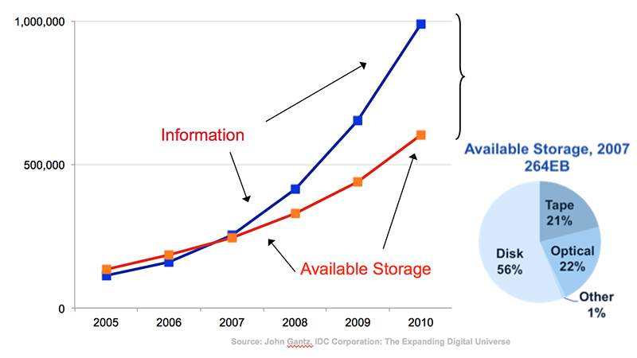
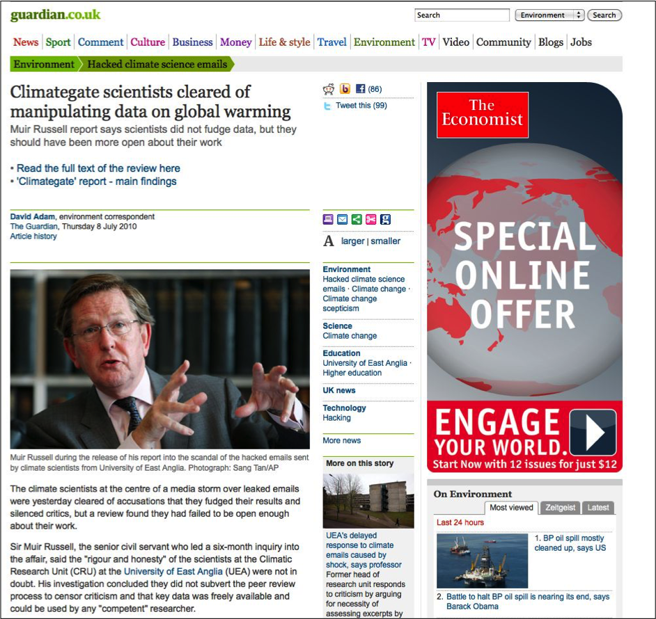

## Why Data Management?

  

Here are some *notes*.

- Something about the slide
- another thing about the slide

## Lesson Topics

* The data world around us
* Importance of data management
* The data lifecycle
* The case for data management 

Note:
The topics covered in this module will answer the questions: 

## Learning Objectives

* Give two general examples of why increasing amounts of data is a concern
* Explain, using two examples, how lack of data management makes an impact
* Define the research data lifecycle
* Give one example of how well-managed data can result in new scientific conclusions

## Data Realities

## 

  

Note:
The world today is filled with science news, from climate change to hurricanes – and it all affects the people inhabiting the earth. 

## Data Deluge

Data is collected from sensors, sensor networks, remote sensing, observations, 
and more -  this calls for increased attention to data management and stewardship. 

  
 
 
 
## A World of Data

Note:
The amount of available storage is not keeping up with the amount of data flooding in daily. How do we decide what data we keep? 

## Data Loss

* Natural disaster 
* Facilities infrastructure failure 
* Server hardware/software failure
* Application software failure
* External dependencies (e.g. PKI failure)
* Format obsolescence
* Legal encumbrance 
* Human error
* Malicious attack by human or automated agents
* Loss of staffing competencies
* Loss of institutional commitment 
* Loss of financial stability 
* Changes in user expectations and requirements
  

## Poor Data Management Affects Everyone

**AUDIT:  JUSTICE STATS ON ANTI-TERROR CASES FLAWED” (AP) February 2007**
> The Justice Department Inspector General found only two sets of data out of 26  
> concerning terrorism attacks were accurate. The Inspector General said the data “appear to be 
> the result of decentralized and haphazard methods of collections … and do not appear 
> to be intentional.” 

**OOPS! TECH ERROR WIPES OUT Alaska Info” (AP) March 2007**
> A technician managed to delete the data and backup for the $38 billion Alaska oil   
> revenue fund – money received by residents of the State. Correcting the errors cost the 
> State an additional $220,700.

Note:
Data Costs

Consider some of the data management issues that made headlines, affecting agencies and organizations.  Data quality is not limited to any one organization.  These examples show costs (in terms of money lost) due to a lack of data quality control.

## Poor Data Management Example

A wildlife biologist for a small field office provided support for staff GIS needs. 
The data were stored on her workstation. When the biologist relocated to another 
office, no one understood how the data was stored or managed.

Solution: A state office GIS specialist retrieved the workstation and sifted through files trying to salvage relevant data. 

Cost: 1 work month ($4,000) plus the value of 
    data that was not recovered

Consider that the situation could have been worse, because the data was not 
being backed up as it would have been if stored on a server.

## Poor Data Management Example

In preparation for a Resource Management Plan, an office discovered 14 duplicate GPS inventories of roads.  However, because none of the inventories had enough metadata, it was impossible to know which inventory was best or if any of the inventories actually met their requirements.

Solution:  Re-Inventory roads

Cost: Estimated 9 work months/inventory 
        @$4,000/wm 
        (14 inventories = $504,000)

## Importance of Data Management

Please forgive my paranoia about protocols, standards, and data review.  I'm in the latter stages of a long career with USGS (30 years, and counting), and have experienced much.  Experience is the knowledge you get just after you needed it. 

Several times, I've seen colleagues called to court in order to testify about conditions they have observed.  

Without a strong tradition of constant review and approval of basic data, they would've been in deep trouble under cross-examination.  Instead, they were able to produce field notes, data approval records, and the like, to back up their testimony.  

It's one thing to be questioned by a college student who is working on a project for school.  It's another entirely to be grilled by an attorney under oath with the media present.”

- Nelson Williams, Scientist US Geological Survey 

## Importance of Data Management

The climate scientists at the centre of a media storm over leaked emails were yesterday cleared of accusations that they fudged their results and silenced critics, but a review found they had failed to be open enough about their work.

	

